# Conjur React UI

A lightweight web interface for exploring and managing a local Conjur OSS environment.

This project provides a modern React-based UI for Conjur OSS, focused on making it easier to explore Conjur concepts such as resources, secrets, authenticators, groups, and policies without needing to interact directly with the API.

The goal is to provide a simple developer-friendly interface for learning, testing, and working with Conjur OSS.

## Table of Contents

- [About](#about)
- [Features for V1](#features-for-v1)
- [Development Environment](#development-environment)
- [Screenshots](#screenshots)
  - [Resources](#resources-1)
  - [Secrets](#secrets-1)
  - [Groups](#groups-1)
  - [Authenticators](#authenticators-1)
  - [Policy Management](#policy-management-1)

## About

Conjur React UI started as a personal project to learn React after transitioning from the Conjur engineering team.

Having spent several years working on Conjur, I wanted to build a lightweight, modern web interface that makes Conjur OSS easier to explore and manage. The project is intended to complement the existing CLI and REST API by providing a graphical interface for common workflows, while also serving as a learning tool for developers new to Conjur.

The long-term goal is to continue expanding the application into a simple, open source management interface for Conjur OSS.

## Features for V1

### Authentication
- ✅ Password authentication
- ⬜ OIDC authentication

### Resources
- ✅ View resources
- ✅ View resource details
- ✅ View resource annotations
- ✅ View resource permissions

### Secrets
- ✅ Browse secrets
- ✅ View secret details
- ✅ Add/Update Secret 
- ⬜ Secret history

### Groups
- ✅ Browse groups
- ✅ View group details
- ✅ Add/Remove members from group

### Authenticators
- ✅ Browse authenticators
- ✅ View authenticator details
- ✅ Enable Authenticators
- ✅ Create Authenticators with V2 API
- ⬜ Authenticator validation/testing

### Policy Management
- ✅ YAML policy editor
- ✅ YAML policy validations through editor
- ✅ View Effective policy
- ✅ View policy history
- ✅ Load policies
- ✅ Policy dry-run validation
- ✅ View created, deleted, and updated resources during dry-run


## Development Environment

This project is designed to run alongside the Conjur OSS development environment.

The Conjur backend should be started using the Conjur development instructions:

https://github.com/cyberark/conjur/blob/master/CONTRIBUTING.md

Start the Conjur development environment:

```bash
cd conjur/dev
./start.sh
```

## Screenshots

### Resources

#### Resources List
Browse all Conjur resources with filtering and quick access to resource details.

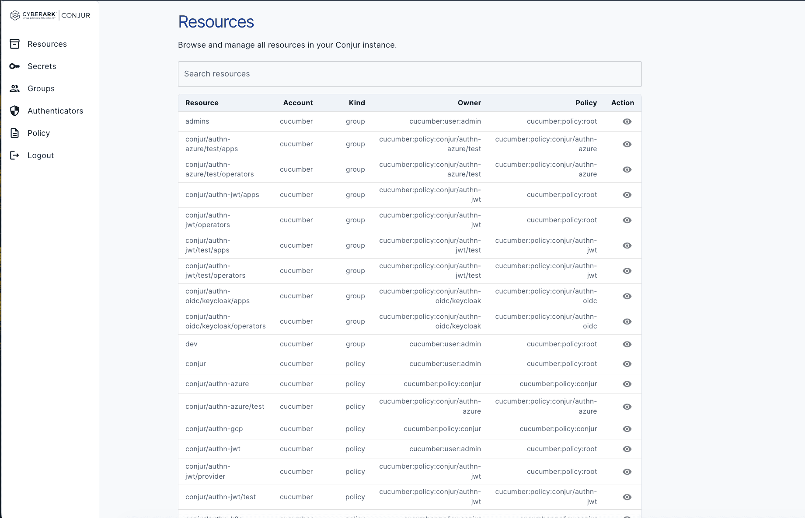

#### Resource Details
View resource metadata, annotations, permissions, and ownership.

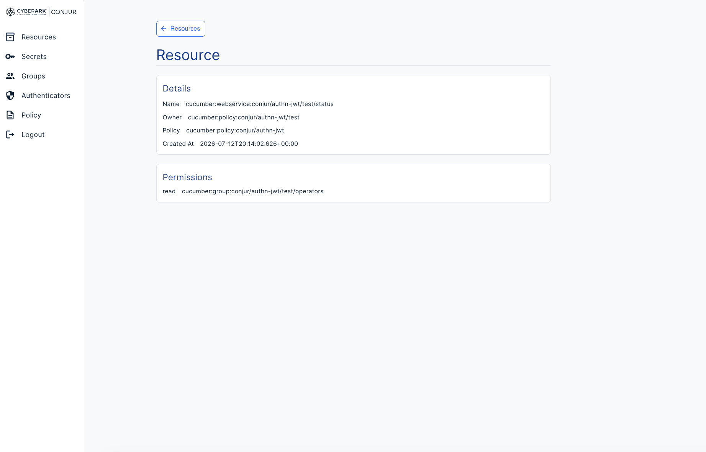

---

### Secrets

#### Secrets List
Browse all Conjur secrets available in the selected account.

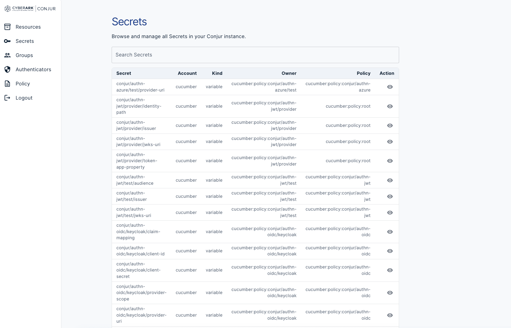

#### Secret Details
Inspect an individual secret and view its metadata.

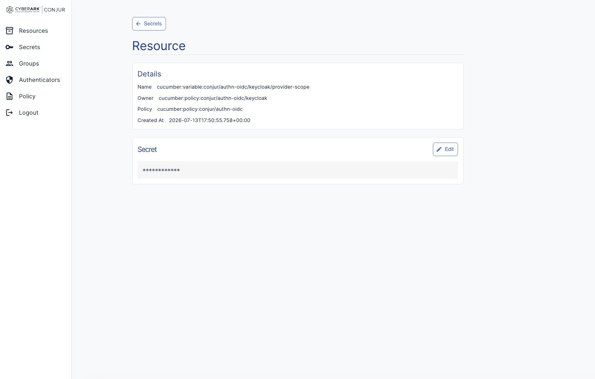

#### Edit Secret
Update an existing secret directly from the UI.

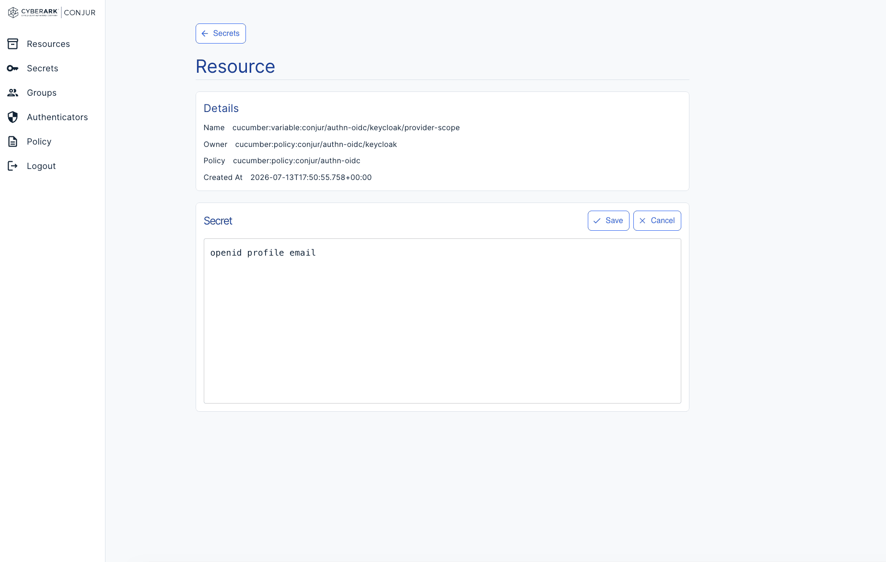

---

### Groups

#### Groups List
Browse all groups defined within Conjur.

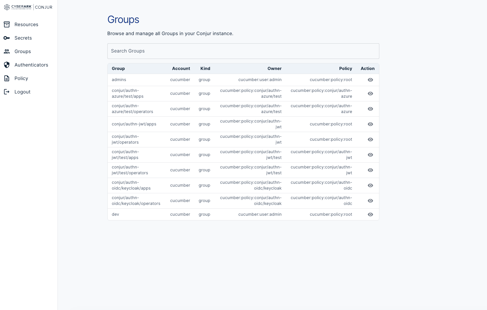

#### Group Details
View group information and current membership.

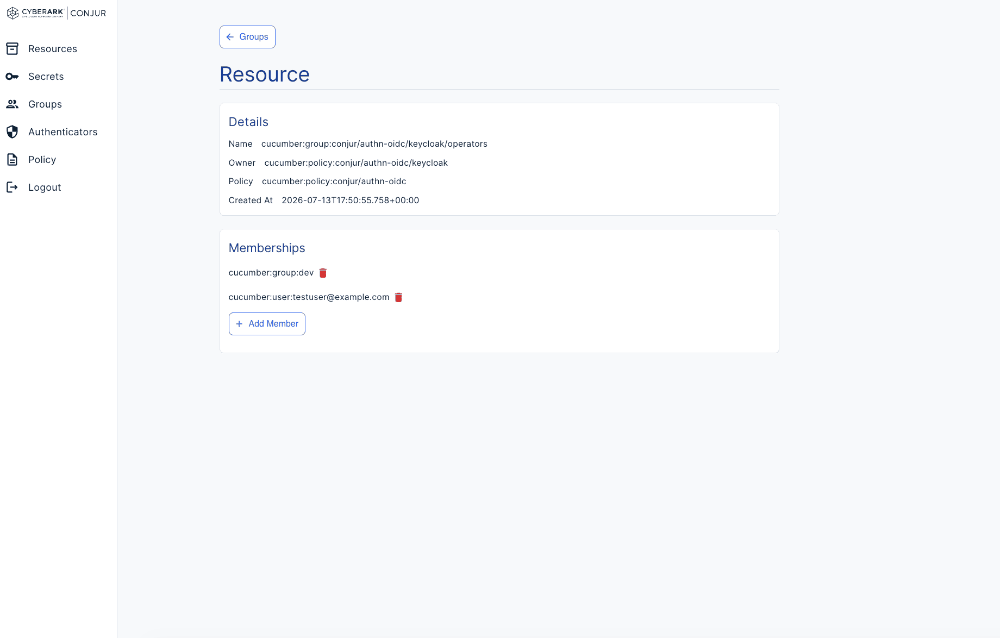

#### Edit Membership
Add or remove members from a group.

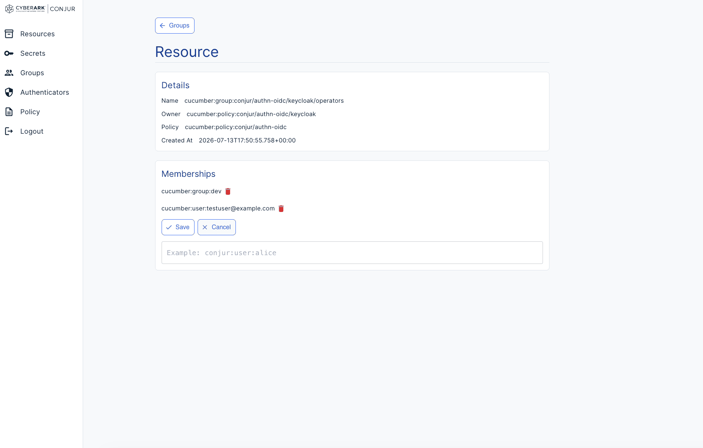

---

### Authenticators

#### Authenticators List
Browse all configured authenticators.

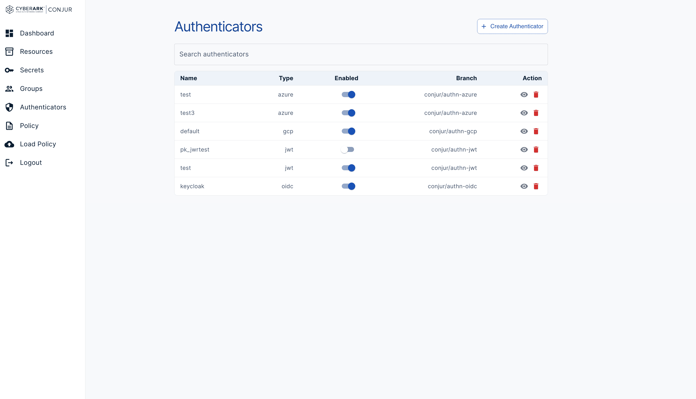

#### Authenticator Details
View authenticator configuration and enable or update authenticators.

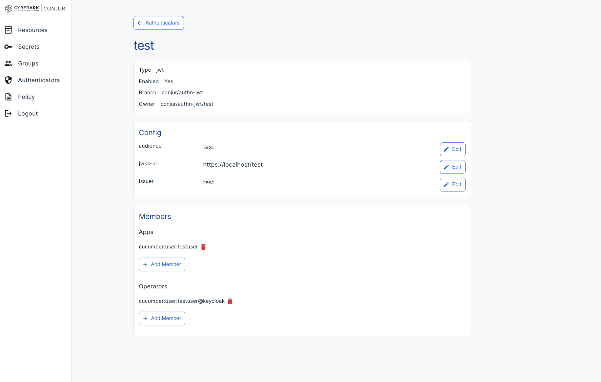

---

### Policy Management

#### Policies List
Browse policies loaded into Conjur.

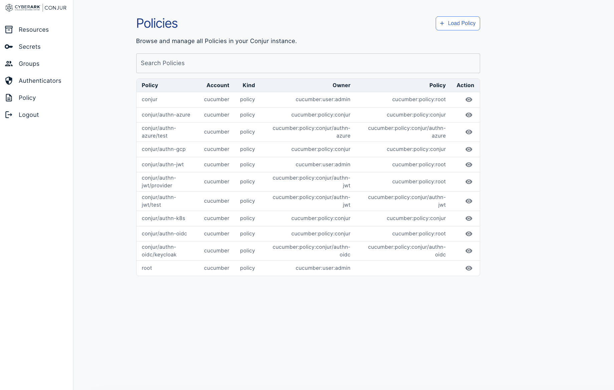

#### Policy Details
View the contents and metadata of an individual policy.

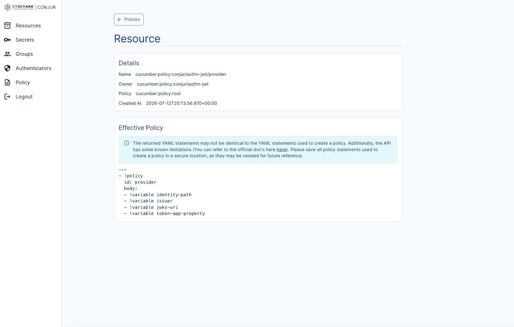

#### Policy Editor
Edit policies using the built-in YAML editor.

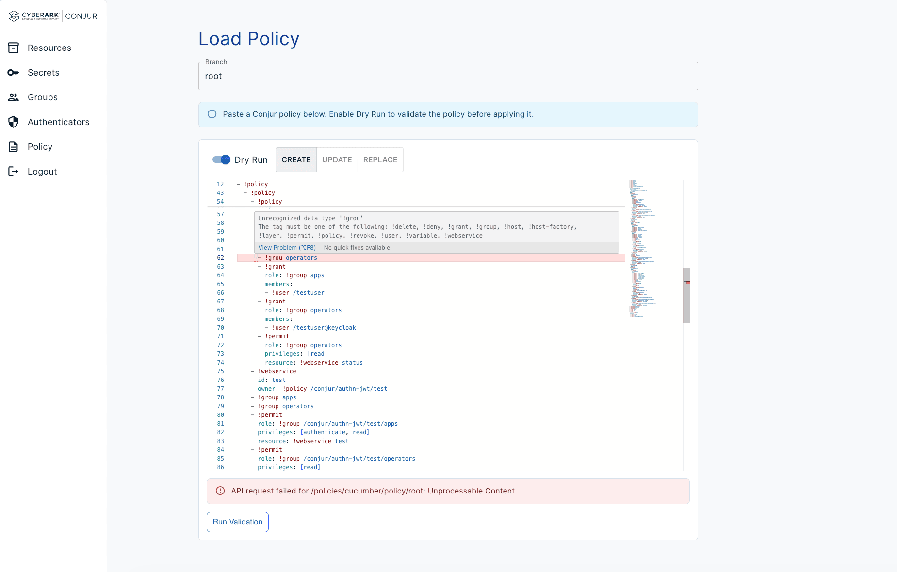

#### Dry Run Results
Review the resources that will be created, updated, or deleted during a dry run.

