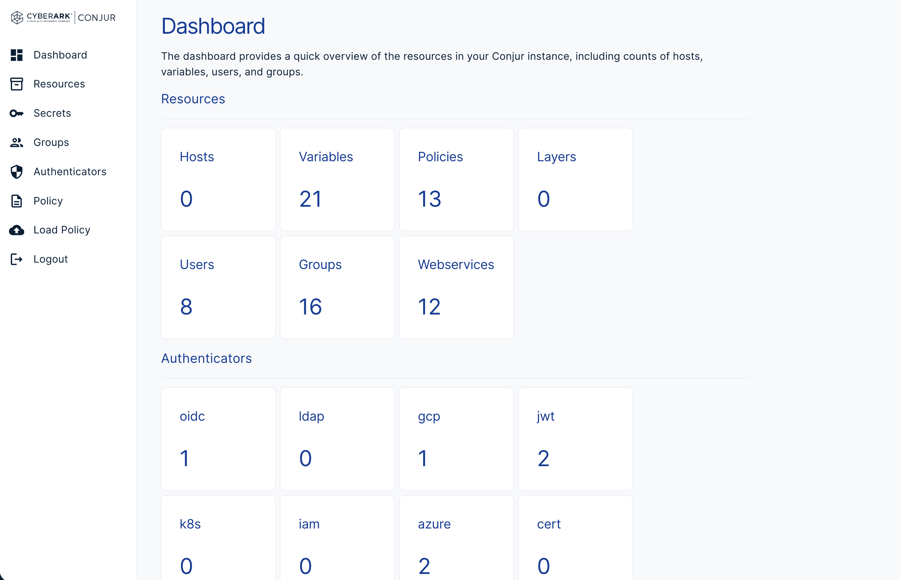
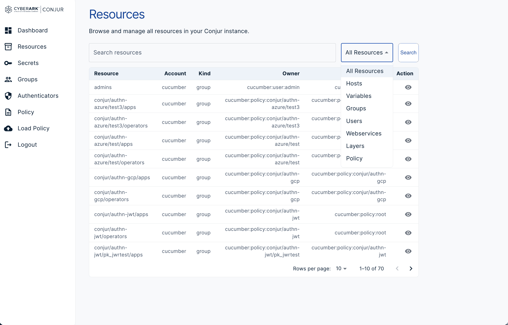
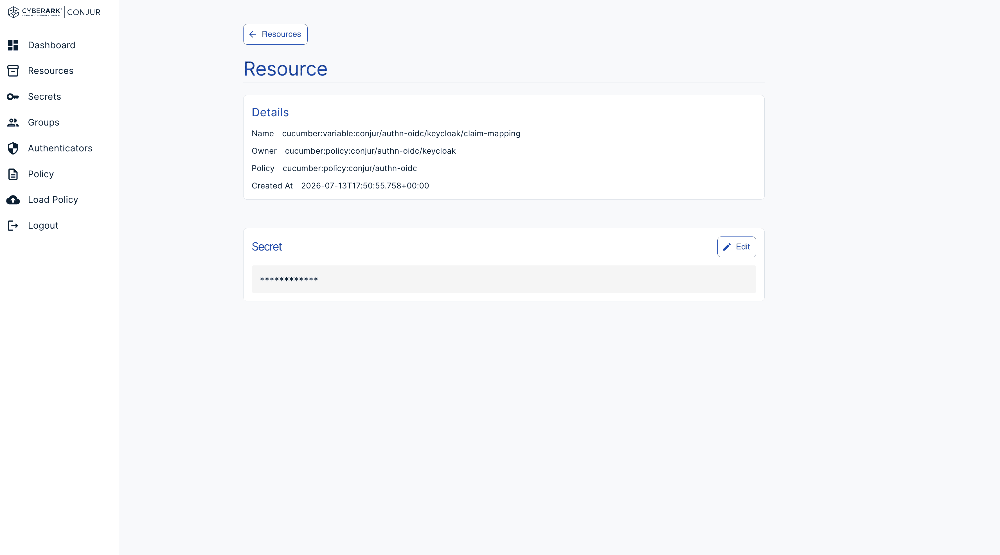
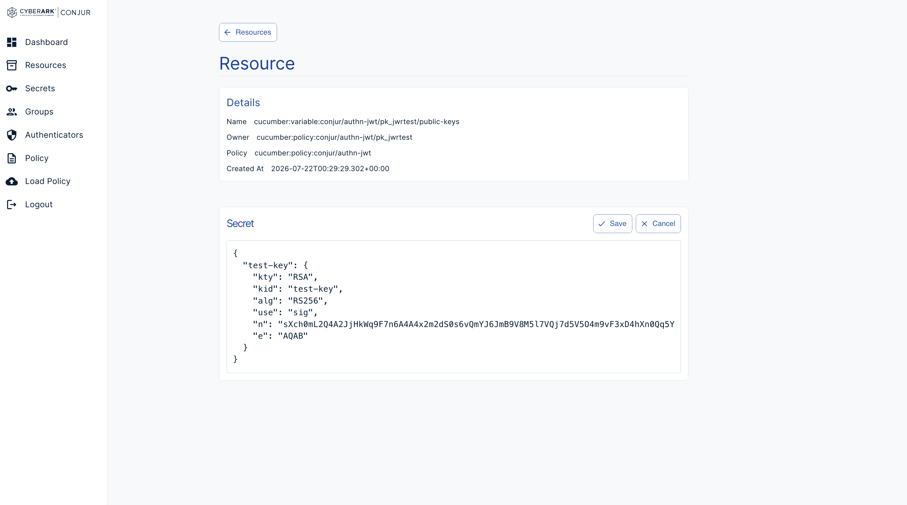
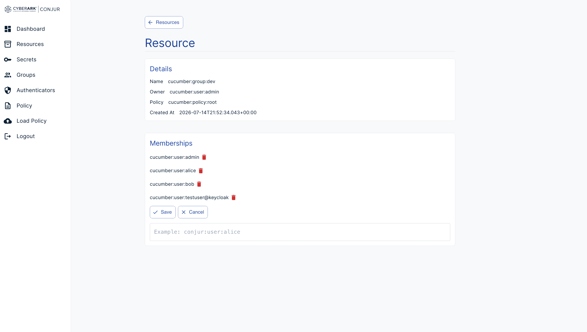
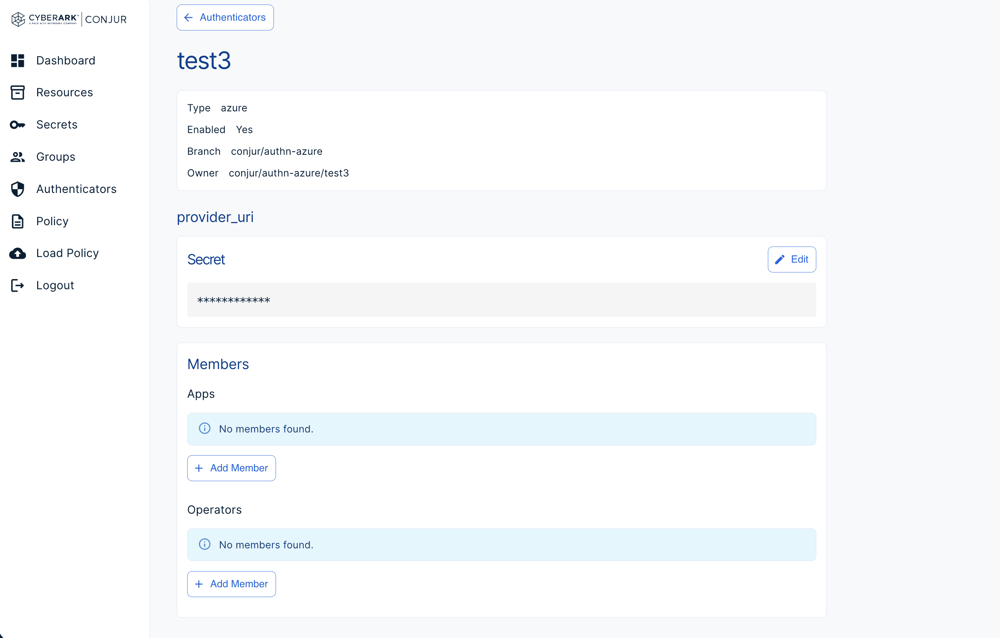
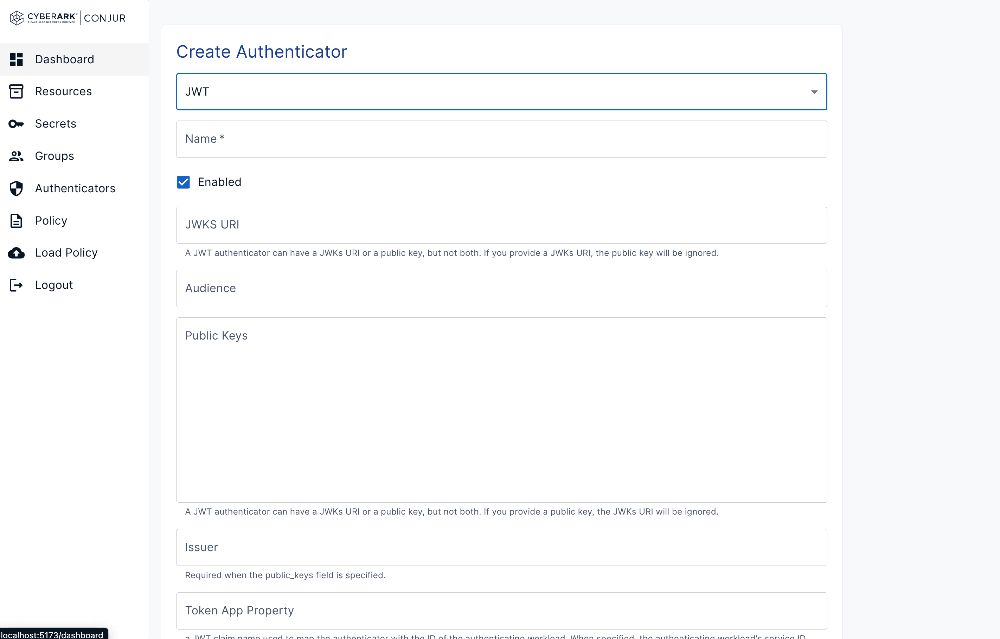
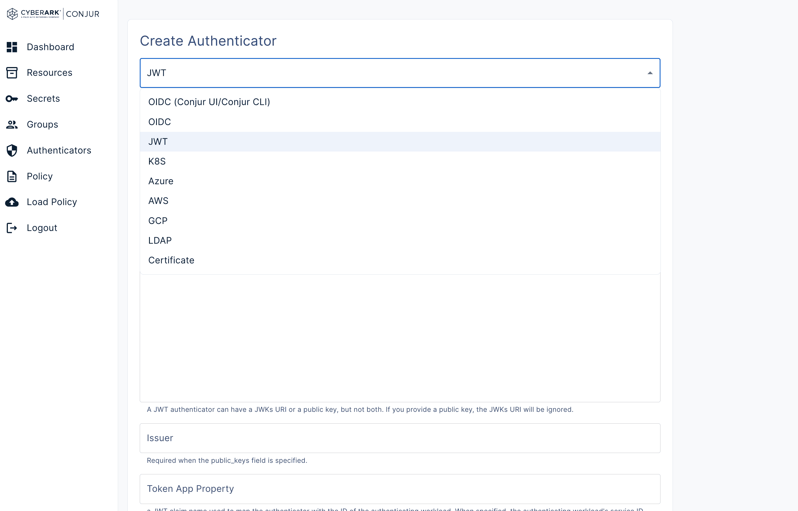
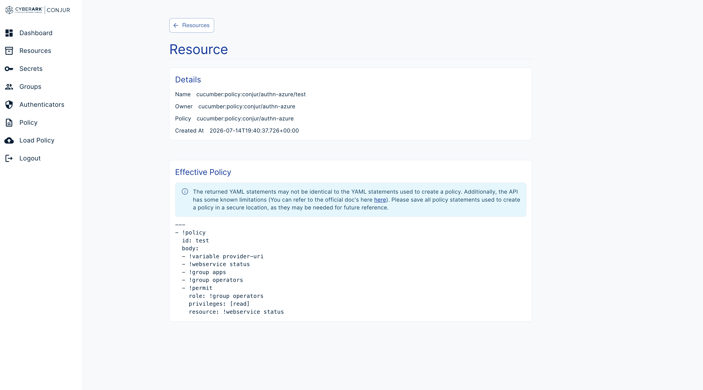

# Conjur UI React 

A lightweight React-based administration interface for Conjur OSS. It provides a modern web UI for managing resources, secrets, policies, groups, and authenticators while complementing the existing CLI and REST API.

The goal is to provide a simple developer-friendly interface for learning, testing, and working with Conjur OSS.

## Table of Contents

- [About](#about)
- [Non-Goals](#non-goals)
- [Features for V1](#features-for-v1)
- [V2 - Scaling and Visualization](#v2---scaling-and-visualization)
- [Development Environment](#development-environment)
- [Screenshots](#screenshots)
  - [Resources](#resources-1)
  - [Secrets](#secrets-1)
  - [Groups](#groups-1)
  - [Authenticators](#authenticators-1)
  - [Policy Management](#policy-management-1)

## About

Conjur React UI started as a personal project to learn React after transitioning from the Conjur engineering team.

Having spent several years working on Conjur, I wanted to build a lightweight, modern web interface that makes Conjur OSS easier to explore and manage. The project is intended to complement the existing CLI and REST API by providing a graphical interface for common workflows, while also serving as a learning tool for developers new to Conjur.

The long-term goal is to continue expanding the application into a simple, open source management interface for Conjur OSS.

## Non-Goals

This project is intended as a **developer learning tool and local sandbox utility** for Conjur OSS. Its goal is to simplify exploring and working with Conjur during development, not to replace or compete with enterprise management solutions.

To maintain that focus, the following features are **explicitly out of scope**:

- **Production security features**, such as advanced cluster health monitoring, enterprise-grade auditing, and operational dashboards.
- **Enterprise-only capabilities**, including features such as Dynamic Secrets, advanced replication synchronization, and other Conjur Enterprise functionality.

For production deployments, high-availability configurations, compliance reporting, and enterprise secret lifecycle management, please refer to the official CyberArk Conjur Enterprise documentation.

## Features for V1

### Authentication
- ✅ Password authentication
- ⬜ OIDC authentication

### Resources
- ✅ View resources
- ✅ View resource details
- ✅ View resource annotations
- ✅ View resource permissions

### Secrets
- ✅ Browse secrets
- ✅ View secret details
- ✅ Add/Update Secret 
- ⬜ Secret history

### Groups
- ✅ Browse groups
- ✅ View group details
- ✅ Add/Remove members from group

### Authenticators
- ✅ Browse authenticators
- ✅ View authenticator details
- ✅ Enable Authenticators
- ✅ Create Authenticators with V2 API
- ✅ dynamic forms for authentictors 
- ⬜ Authenticator validation/testing

### Policy Management
- ✅ YAML policy editor
- ✅ YAML policy validations through editor
- ✅ View Effective policy
- ✅ View policy history
- ✅ Load policies
- ✅ Policy dry-run validation
- ✅ View created, deleted, and updated resources during dry-run

### V2 - Scaling and Visualization

The goal of V2 is to improve usability for larger Conjur environments and make

authorization relationships easier to understand.

- ⬜ Role/resource graph visualization

  - Visualize relationships between users, groups, layers, policies, resources, and permissions

  - Help answer "why does this identity have access to this resource?"

- ✅ Server-side resource search

  - Move filtering from the UI into API queries

  - Support searching large environments without loading all resources locally

- ✅ Resource pagination

  - Add offset/limit pagination for large resource collections

  - Improve performance and initial load times

- ⬜ Advanced resource filtering

  - Filter by resource type, ownership, policy branch, and permissions

## Development Environment

Conjur React UI is designed to run alongside the Conjur OSS development environment.

The React application does not create or manage its own Conjur instance. Instead, it connects to an existing Conjur development stack and communicates with Conjur through the Vite development proxy.

For detailed setup instructions, Docker configuration, networking requirements, and connecting to other Conjur environments, see:

[Conjur React Development Environment](./dev/README.md)

The Conjur backend should be started using the official Conjur development instructions:

https://github.com/cyberark/conjur/blob/master/CONTRIBUTING.mdgit

## Screenshots

### Dashboard

#### Dashboard Overview
View an overview of the Conjur environment and common administration workflows.

---

### Resources

#### Resources List
Browse all Conjur resources with filtering and quick access to resource details.
This includes server side filtering, searching and pagination

#### Resource Details
View resource metadata, annotations, permissions, and ownership. Different sections will be displayed based on resource type, like gorup, secret and policy.

---

### Secrets

#### Secret Details
Inspect an individual secret and view its metadata.

#### Edit Secret
Update an existing secret directly from the UI.

---

### Groups

#### Group Management
View and manage group membership within Conjur.

---

### Authenticators

#### Authenticators List
Browse all configured authenticators.

#### Authenticator Details
View authenticator configuration and mange its secret values and groups.

#### Create Authenticator
Create authenticators using guided forms.

#### Create Authenticator - Multiple Types
Create authenticators across multiple supported authentication methods.

---

### Policy Management

#### Effective Policy
View the effective policy generated from loaded policy content.

#### Policy Editor
Edit policies using the built-in YAML editor with validation feedback.

#### Policy Dry Run
Review resources that will be created, updated, or deleted before loading a policy.

